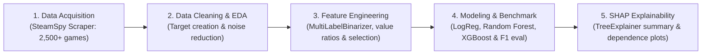

# 🎮 Steam Game Rating Prediction & SHAP Explainability Pipeline

[](https://www.python.org/)
[](LICENSE)
[](https://xgboost.readthedocs.io/)
[](https://scikit-learn.org/)
[](https://shap.readthedocs.io/)
[](https://steamspy.com/api.php)

An end-to-end Machine Learning and interpretability pipeline that scrapes **2,500+ active Steam games**, engineers high-cardinality multi-label tags and economic playtime ratios, trains tree-based ensembles to predict high community ratings (`> 70%` positive reviews), and explains model decisions using **SHAP (SHapley Additive exPlanations)**.

---

## 🌟 Interactive Showcase Dashboard

This repository includes a standalone, responsive web dashboard (`index.html`) featuring:
- **Interactive Rating Simulator**: Adjust game price, concurrent players (CCU), playtime, and toggle community tags to observe real-time predicted rating probabilities powered by learned SHAP weights.
- **Embedded Visual Galleries**: High-resolution zoomable plots for all 5 phases.
- **Interactive Dataset Explorer**: Searchable preview of top games in the dataset.

To view locally:
```powershell
# Open directly in your browser:
start index.html
# Or serve with Python:
python -m http.server 8000
```

---

## 🏗️ Architecture Pipeline



---

## 📊 Benchmark Results (500 Holdout Test Games)

All models were evaluated on a stratified 20% holdout test set (444 positive, 56 non-positive) ensuring zero data leakage:

| Model | Accuracy | Positive Class F1 | Minority Class F1 | Weighted F1 | Macro F1 | ROC-AUC |
| :--- | :---: | :---: | :---: | :---: | :---: | :---: |
| **Logistic Regression** (Balanced, Scaled) | 78.0% | 0.8635 | 0.4330 | 0.8153 | 0.6483 | 0.8598 |
| **Random Forest** (250 Trees, Balanced) | **90.0%** | **0.9434** | **0.5686** | **0.9015** | **0.7560** | 0.8804 |
| **XGBoost Classifier** (Balanced Weights) | **87.8%** | **0.9306** | **0.4960** | **0.8819** | **0.7132** | **0.8844** |

> **Key Takeaway**: XGBoost achieves superior discrimination with **0.8844 ROC-AUC**, while Random Forest achieves the highest overall accuracy (**90.0%**) and **0.9015 Weighted F1**.

---

## 🔬 Key SHAP Explainability Discoveries

1. **The "Indie" Goodwill Advantage**:
   - `genre_Indie` and `tag_Indie` exert a strong positive push on rating probability (mean $|SHAP| = 0.263$).
   - Players demonstrate higher tolerance and active advocacy for indie titles compared to AAA games.
2. **Pricing & Value Dynamics**:
   - `price`, `initial_price`, and `price_per_hour_playtime` are among the top 4 global decision drivers.
   - **Free-to-Play vulnerability**: Free games suffer from negative rating drag due to aggressive monetization, smurfing, and battle pass fatigue.
   - **The $10–$30 sweet spot**: Mid-priced titles that deliver substantial playtime per dollar show consistently positive Shapley contributions.
3. **The Multiplayer Review Penalty**:
   - `tag_Multiplayer` and `tag_PvP` carry a net negative bias unless buffered by high concurrent player volume (`log_ccu`), reflecting community grievances over server latency, cheat detection, and matchmaking.

---

## 📂 Project Structure

```
steam_project/
├── index.html                        # Interactive showcase dashboard
├── requirements.txt                  # Python dependencies
├── README.md                         # Project documentation
├── data/
│   ├── steam_games_raw.csv           # 2,500 raw scraped games
│   ├── steam_games_raw.json          # Raw JSON records
│   ├── steam_games_cleaned.csv       # Cleaned dataset (0 missing values)
│   ├── steam_games_cleaned.json      # Cleaned JSON records
│   ├── steam_features_all.csv        # Full 474 engineered features
│   ├── steam_features_selected.csv   # Top 60 curated features + target
│   └── feature_metadata.json         # Feature importance dictionary
├── models/
│   └── best_xgboost_model.pkl        # Serialized best XGBoost model
├── reports/
│   ├── eda_report.md                 # Exploratory data analysis report
│   ├── model_evaluation_report.md    # Model benchmark report
│   ├── shap_analysis_report.md       # SHAP explainability report
│   └── figures/                      # Publication-quality charts (300 DPI)
│       ├── target_distribution.png
│       ├── rating_vs_price.png
│       ├── top_tags.png
│       ├── top_genres.png
│       ├── playtime_and_engagement.png
│       ├── feature_importance_preliminary.png
│       ├── confusion_matrices.png
│       ├── roc_curves.png
│       ├── shap_summary_beeswarm.png
│       ├── shap_feature_importance.png
│       ├── shap_dependence_price.png
│       ├── shap_dependence_indie.png
│       └── shap_dependence_multiplayer.png
└── src/
    ├── __init__.py
    ├── scraper.py                    # Phase 1: Data Acquisition
    ├── cleaner.py                    # Phase 2: Data Cleaning
    ├── eda.py                        # Phase 2: Exploratory Analysis
    ├── features.py                   # Phase 3: Feature Engineering & Selection
    ├── models.py                     # Phase 4: Modeling & Benchmark
    └── explain.py                    # Phase 5: SHAP Analysis
```

---

## 🚀 Quickstart & Reproduction

### 1. Installation
Clone the repository and install the dependencies:
```bash
git clone https://github.com/<USERNAME>/<REPO>.git
cd steam_project
pip install -r requirements.txt
```

### 2. Running Each Phase

```powershell
# Phase 1: Scrape & enrich 2,500 Steam games
python -m src.scraper --target 2500 --workers 4

# Phase 2: Clean data & generate EDA visualizations
python -m src.cleaner
python -m src.eda

# Phase 3: Engineer multi-label features & apply variance selection
python -m src.features --threshold 0.01 --top-k 60

# Phase 4: Train models & generate benchmark evaluation
python -m src.models

# Phase 5: Run SHAP TreeExplainer & generate interpretability plots
python -m src.explain
```

---

## ⚖️ License
Distributed under the MIT License. See `LICENSE` for details.
